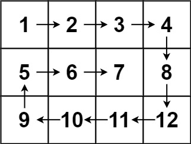

# 🌀 LeetCode 54 — Spiral Matrix / 螺旋矩陣遍歷
🔗 [題目連結](https://leetcode.com/problems/spiral-matrix/)

---

## 📄 題目說明 | Problem Description

- **中文**：給你一個 m * n 的整數矩陣 `matrix`，請你以螺旋（順時針）順序遍歷矩陣中的所有元素，並回傳遍歷後的元素列表。  
- **English**: Given an m * n matrix `matrix`, return all the elements of the matrix in spiral order (clockwise).

- **Examples**:
    - Example 1:

        
        
        - Input: matrix = [[1,2,3],[4,5,6],[7,8,9]]
        
        - Output: [1,2,3,6,9,8,7,4,5]
    
    - Example 2:

        

        - Input: matrix = [[1,2,3,4],[5,6,7,8],[9,10,11,12]]
        
        - Output: [1,2,3,4,8,12,11,10,9,5,6,7]
 


---

## 🧠 解題思路 | Solution Idea

我們可以用四條邊界 + 方向控制法來模擬螺旋遍歷：

1. 設定四個邊界：  
   - `top = 0`（最上邊界）  
   - `bottom = m - 1`（最下邊界）  
   - `left = 0`（最左邊界）  
   - `right = n - 1`（最右邊界）

2. 在條件 `top ≤ bottom && left ≤ right` 下，按以下順序遍歷並收集元素：

   - **向右走**：遍歷頂邊界 row `top`，從 `left` 到 `right`，然後 `top += 1`  
   - **向下走**：遍歷右邊界 col `right`，從 `top` 到 `bottom`，然後 `right -= 1`  
   - **向左走**（若 `top ≤ bottom`）：遍歷底邊界 row `bottom`，從 `right` → `left`，然後 `bottom -= 1`  
   - **向上走**（若 `left ≤ right`）：遍歷左邊界 col `left`，從 `bottom` → `top`，然後 `left += 1`

3. 重複上述過程，直到所有元素都被加入結果為止。

這種方法用邊界不斷收縮 + 方向切換的方式達到螺旋遍歷。

---

## 💻 程式碼實作 | Code (Python)

```python
from typing import List

class Solution:
    def spiralOrder(self, matrix: List[List[int]]) -> List[int]:
        if not matrix:
            return []

        m, n = len(matrix), len(matrix[0])
        result = []

        top, bottom = 0, m - 1
        left, right = 0, n - 1

        while top <= bottom and left <= right:
            # → 向右遍歷 top 行
            for j in range(left, right + 1):
                result.append(matrix[top][j])
            top += 1

            # ↓ 向下遍歷 right 列
            for i in range(top, bottom + 1):
                result.append(matrix[i][right])
            right -= 1

            # ← 向左遍歷 bottom 行（條件式防止重複）
            if top <= bottom:
                for j in range(right, left - 1, -1):
                    result.append(matrix[bottom][j])
                bottom -= 1

            # ↑ 向上遍歷 left 列（條件式防止重複）
            if left <= right:
                for i in range(bottom, top - 1, -1):
                    result.append(matrix[i][left])
                left += 1

        return result
```

| 區段      | 程式碼                                                                                                          | 功能 / 解釋             |
| ------- | ------------------------------------------------------------------------------------------------------------ | ------------------- |
| 檢查空矩陣   | `if not matrix: return []`                                                                                   | 若輸入為空陣列，直接回傳空列表     |
| 初始化     | `m, n = len(matrix), len(matrix[0])`<br>`top, bottom, left, right = 0, m-1, 0, n-1`<br>`result = []`         | 取得矩陣大小、設定四邊界、準備結果列表 |
| 主迴圈     | `while top ≤ bottom and left ≤ right:`                                                                       | 確保遍歷區域還存在（沒有交錯）     |
| 向右走     | `for j in range(left, right+1): result.append(matrix[top][j])`<br>`top += 1`                                 | 遍歷頂邊界，然後把上界下移       |
| 向下走     | `for i in range(top, bottom+1): result.append(matrix[i][right])`<br>`right -= 1`                             | 遍歷右邊界，然後把右界左移       |
| 向左走（條件） | `if top ≤ bottom:`<br>`for j in range(right, left-1, -1): result.append(matrix[bottom][j])`<br>`bottom -= 1` | 若上下界仍有效，遍歷底邊界並把下界上移 |
| 向上走（條件） | `if left ≤ right:`<br>`for i in range(bottom, top-1, -1): result.append(matrix[i][left])`<br>`left += 1`     | 若左右界仍有效，遍歷左邊界並把左界右移 |
| 回傳結果    | `return result`                                                                                              | 回傳螺旋順序的所有元素         |

- top/bottom、left/right 的邊界在 while 裡面會被改變

    - 所以：

        - while 的條件是迴圈「開始前」檢查

        - 但在迴圈「過程中」，我們自己手動做了 top += 1, right -= 1, bottom -= 1, left += 1

    - 這會造成後面的方向（向左、向上）可能會多跑、跑重複、甚至跑越界。
    - 所以必須加：if top <= bottom: if left <= right: 來保護不會多走錯誤的方向。


### 📘 解釋 range(left, right + 1)
- range(start, stop) 的 stop 是「不包含」的邊界。

- 若要包含 right，就要寫 stop = right + 1。

- 所以 range(left, right + 1) 表示從 left 到 right（包含）逐一遍歷。

### 📘 解釋 range(right, left - 1, -1)
- range(start, stop, step)

    - 會從 start 走到 不含 stop

    - 每次加上 step（正數向右、負數向左）

    - 當要從右往左掃時，應該從 right 開始，走到 left 結束（包含 left）。

---

## 🧪 範例流程 | Example Walkthrough

- 假設範例矩陣：
```python
matrix = [
  [1, 2, 3],
  [4, 5, 6],
  [7, 8, 9]
]
```

### 🧾 初始狀態

- m = 3, n = 3

- top = 0, bottom = 2, left = 0, right = 2

- result = []

### 第 1 輪 while：top=0, bottom=2, left=0, right=2（條件成立）

#### → 向右遍歷 top 行（row = 0）

- 從 j = left 到 j = right：

    - matrix[0][0] = 1 → result = [1]

    - matrix[0][1] = 2 → result = [1,2]

    - matrix[0][2] = 3 → result = [1,2,3]

- 然後 top += 1 → top = 1

#### ↓ 向下遍歷 right 列（col = right = 2）

- 從 i = top 到 i = bottom：

    - matrix[1][2] = 6 → result = [1,2,3,6]

    - matrix[2][2] = 9 → result = [1,2,3,6,9]

- 然後 right -= 1 → right = 1

#### ← 向左遍歷 bottom 行（row = bottom = 2），條件：if top <= bottom（1 ≤ 2）

- 從 j = right 到 j = left 倒序：

    - matrix[2][1] = 8 → result = [1,2,3,6,9,8]

    - matrix[2][0] = 7 → result = [1,2,3,6,9,8,7]

- 然後 bottom -= 1 → bottom = 1

#### ↑ 向上遍歷 left 列（col = left = 0），條件：if left <= right（0 ≤ 1）

- 從 i = bottom 到 i = top 倒序：

    - matrix[1][0] = 4 → result = [1,2,3,6,9,8,7,4]

- 然後 left += 1 → left = 1

#### 邊界更新後

- 現在變為：

    - top = 1, bottom = 1

    - left = 1, right = 1

- 仍然滿足 top ≤ bottom 且 left ≤ right → 進入下一輪

### 第 2 輪 while：top=1, bottom=1, left=1, right=1
#### → 向右遍歷 top 行（row = 1）

- 從 j = 1 到 j = 1：

    - matrix[1][1] = 5 → result = [1,2,3,6,9,8,7,4,5]

- 然後 top += 1 → top = 2

#### ↓ 向下遍歷 right 列（col = 1），從 i = top=2 到 i = bottom=1 → i 起點 > 終點，所以這個方向不會加入任何新元素。

- 然後 right -= 1 → right = 0

- 接下來 top = 2 > bottom = 1 或 left = 1 > right = 0 的條件會讓 while 迴圈結束。

### ✅ 最終結果

- result = [1,2,3,6,9,8,7,4,5]

- 這正是範例矩陣的螺旋順序遍歷。

---

## ⏱ 複雜度分析 | Complexity Analysis

- 時間複雜度：𝑂(𝑚 × 𝑛)，每個元素恰被加入一次

- 空間複雜度：𝑂(𝑚 × 𝑛) for the output list (但除了輸出，額外空間為常數 𝑂(1))

---

## ✍️ 我學到的東西 | What I Learned

- 四邊界 + 收縮 + 方向切換是實作螺旋遍歷的通用模板

- 必須在向左與向上遍歷前加條件檢查，避免重複遍歷同一行／列

- 邊界收縮時要小心更新順序，避免漏掉或重複

- 分析複雜度要區分「額外使用空間」與「輸出空間」