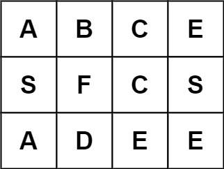

# 📘 Leetcode 79 — Word Search 解法筆記（使用你提供的版本）
🔗 [題目連結](https://leetcode.com/problems/word-search/)

---

## 📄 題目說明 | Problem Description

### 中文
給定一個字母的 2D 網格 board 和一個字串 word，判斷 word 是否能夠在網格中找到。

移動限制：

- 只能從上下左右相鄰的格子走。

- 不能重複使用同一格子。

### English

Given a 2D character grid `board` and a string `word`, return `True` if `word` exists in the grid. The word must be constructed from letters of sequentially adjacent cells (horizontal or vertical), and the same letter cell may not be used more than once.

### Examples
- Example 1:

    

    - Input: board = [["A","B","C","E"],["S","F","C","S"],["A","D","E","E"]], word = "ABCCED"
    - Output: true

- Example 2:

    

    - Input: board = [["A","B","C","E"],["S","F","C","S"],["A","D","E","E"]], word = "SEE"
    - Output: true

- Example 3:

    

    - Input: board = [["A","B","C","E"],["S","F","C","S"],["A","D","E","E"]], word = "ABCB"
    - Output: false

---

## 🧠 解法思路 | Solution Idea

### 中文思路  
- 我們不知道單詞會從哪一格開始，因此從每一格都試一次。  
- 使用 DFS + 回溯：當格子字母與當前需要匹配的字母相符時，繼續往四個方向探索下一個字母。  
- 探索過程中用特殊標記（如 `'#'`）把該格標記為已使用，以避免重複使用。  
- 若某條路徑能比完整個 `word`，就返回 `True`；若所有起點都試完還沒找到，則返回 `False`。

### English Idea  
- Because we don’t know which cell is the start, we try DFS from every cell.  
- If the board cell matches `word[i]`, then we recursively search its neighbors for `word[i+1]`.  
- Use backtracking: mark the cell as visited (e.g. `'#'`), then restore it.  
- If we manage to match all characters, return `True`. Otherwise, after exhausting all possibilities, return `False`.

---

## 💻 程式碼 | Python Implementation

```python
def exist(board, word):
    rows, cols = len(board), len(board[0])

    def dfs(r, c, i):
        if i == len(word):
            return True
        if r < 0 or c < 0 or r >= rows or c >= cols:
            return False
        if board[r][c] != word[i]:
            return False

        temp = board[r][c]
        board[r][c] = '#'  # 標記為已訪問

        found = (
            dfs(r+1, c, i+1) or
            dfs(r-1, c, i+1) or
            dfs(r, c+1, i+1) or
            dfs(r, c-1, i+1)
        )

        board[r][c] = temp  # 回溯還原
        return found

    for i in range(rows):
        for j in range(cols):
            if dfs(i, j, 0):
                return True

    return False
```
```python
rows, cols = len(board), len(board[0])
```
- 儲存 board 的行數與列數。

```python
def dfs(r, c, i):
```
- 宣告 DFS 遞迴函數，r 與 c 是目前位置，i 是目前在 word 中的第幾個字母。

```python
if i == len(word):
    return True
```
- 如果已經成功比對整個字串，代表找到完整路徑，回傳 True。

```python
if r < 0 or c < 0 or r >= rows or c >= cols:
    return False
```
- 越界保護，當前位置超出 board 邊界就回傳 False。

```python
if board[r][c] != word[i]:
    return False
```
- 當前格子的字母不等於 word[i]，比對失敗。
### ① 做決定（標記已訪問）
```python
temp = board[r][c]
board[r][c] = '#'
```
- 保存當前格子的值，然後將其標記為「已使用」，避免重複走回同一格。
### ② 試 4 個方向（得到結果，但不要 return）
```python
    found = (
        dfs(r+1, c, i+1) or
        dfs(r-1, c, i+1) or
        dfs(r, c+1, i+1) or
        dfs(r, c-1, i+1)
    )
```
- 對四個方向進行遞迴搜尋，如果其中任一條路成功（回傳 True），則整體為 True。
- 如果不是寫 or 是寫 , 的話這樣 found 會是一個 tuple，例如 (False, False, True, False)。在 Python 裡，非空 tuple 的布林值永遠是 True，就算裡面全是 False：
    ```python
    bool((False, False))  # True
    ```
### ③ 撤銷決定（回溯）
```python
board[r][c] = temp
```
- 回溯：走完這一條路後，要把格子恢復原狀（還原狀態）。
### ④ 回傳結果
```python
return found
```
- 回傳這一輪搜尋的結果。

```python
for i in range(rows):
    for j in range(cols):
        if dfs(i, j, 0):
            return True
```
嘗試從所有格子當作起點，只要有一條路成功，就回傳 True。

```python
return False
```
- 如果所有起點都走過但沒找到，就回傳 False。

---

## 🧪 範例解析
```python
board = [
  ['A','B','C','E'],
  ['S','F','C','S'],
  ['A','D','E','E']
]
word = "ABCCED"
```
```python
起點 (i=0, j=0):
  dfs(0,0,0)  # i = index in word = 0
    board[0][0] = 'A'，等於 word[0] → 符合
    標記 board[0][0] = '#'

    嘗試四個方向：
      dfs(1,0,1)  # 向下
        board[1][0] = 'S' ≠ word[1]='B' → 返回 False
      dfs(-1,0,1) # 向上（越界）→ False
      dfs(0,1,1)  # 向右
        board[0][1] = 'B' = word[1] → 符合
        標記 board[0][1] = '#'

        繼續向下個字母：
        dfs(1,1,2)   # 從 (0,1) 往下
           board[1][1] = 'F' ≠ word[2]='C' → False
        dfs(-1,1,2)  # 向上越界 → False
        dfs(0,2,2)   # 向右
           board[0][2] = 'C' = word[2] → 符合
           標記 board[0][2] = '#'

           繼續：
           dfs(1,2,3)  # 往下
             board[1][2] = 'C' = word[3] → 符合
             標記 board[1][2] = '#'

             繼續：
             dfs(2,2,4)  # 往下
               board[2][2] = 'E' = word[4] → 符合
               標記 board[2][2] = '#'

               繼續：
               dfs(3,2,5) # 往下越界 → False
               dfs(1,2,5) # 往上到 (1,2)，但已經標記為 '#' → 不匹配 → False
               dfs(2,3,5) # 往右
                 board[2][3] = 'E'，但 word[5] = 'D' → 不符 → False
               dfs(2,1,5) # 往左
                 board[2][1] = 'D' = word[5] → 符合
                 i=5 是最後一個字母 → 回傳 True
             
             從 dfs(2,2) 回到這裡 → found = True → 立刻回傳 True
           ...
    在每一層回溯時，還原 board 上被標記的格子為原字母

最終 `exist(...)` 回傳 True
```

---

## 🧠 為什麼用 DFS + 回溯？
- 必須探索所有可能路徑，但一條路失敗後需要「回頭」試別條路。

- 回溯能讓我們「暫時使用格子」後再還原，這是關鍵技巧。

---

## ⏱ 複雜度分析 | Complexity

- 時間複雜度：O(m × n × 4^L)

    - m × n 是起點格子數

    - 每個起點最壞情況做四方向 DFS 長度 L

- 空間複雜度：O(L)

    - 遞迴堆疊深度最多是 word 的長度

---

## ✍ 我學到了什麼 | What I Learned

- DFS + 回溯是解路徑 / 搜索類問題的常見套路

- 當要避免重複使用格子，就得在進入時標記、離開時還原

- 由起點不確定，需要從每格做 DFS 嘗試

- 必須仔細處理遞迴中斷條件與回溯還原邏輯