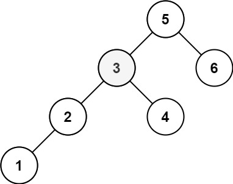

# 🔎 LeetCode 230 – Kth Smallest Element in a BST
🔗 題目連結：[https://leetcode.com/problems/kth-smallest-element-in-a-bst/](https://leetcode.com/problems/kth-smallest-element-in-a-bst/)

---

## 📄 題目說明 | Problem Description

**中文**：

給你一棵二元搜尋樹（BST）的根節點 `root` 和一個整數 `k`，請回傳 BST 中第 k 小的節點值（以 1 為起始索引）。 

**English**: 

Given the root of a Binary Search Tree (BST) and an integer `k`, return the *k-th smallest* value of all the node values in the BST. The counting is 1-indexed.

### Examples
- Example 1:


    Input: root = [3,1,4,null,2], k = 1
    Output: 1

- Example 2:



    Input: root = [5,3,6,2,4,null,null,1], k = 3

    Output: 3

---

## 🧠 解題思路 | Solution Idea

在 BST 中，中序遍歷（In-order Traversal）會依「從小到大」的順序訪問節點。因為 BST 的特性：左邊子樹的所有值 < 節點值 < 右邊子樹的所有值。所以中序遍歷是取得排序結果的一種自然方法。

我們可以利用這樣的特性來停止早一點，不必遍歷整棵樹：

1. 用遞迴 或 用 stack + 迴圈的方式做中序遍歷。  
2. 每訪問一個節點就計數 (例如 `count += 1`)。  
3. 當計數到 `k` 時，就回傳該節點的值，停止遍歷。  
4. 如果遍歷完整棵樹都還沒到 `k`，那題目條件其實保證 k 合法，所以這情況一般不會發生。

---

## 💻 程式碼實作 | Code (Python)

```python
from typing import Optional

class TreeNode:
    def __init__(self, val: int = 0, left: Optional['TreeNode'] = None, right: Optional['TreeNode'] = None):
        self.val = val
        self.left = left
        self.right = right

class Solution:
    def kthSmallest(self, root: Optional[TreeNode], k: int) -> int:
        # stack 用於模擬遞迴中序遍歷
        stack = []
        current = root

        while True:
            # 一直往左走，把節點推進 stack
            while current:
                stack.append(current)
                current = current.left

            # stack 頂端的是當前最小的未訪問節點
            current = stack.pop()
            k -= 1
            if k == 0:
                return current.val

            # 訪問完節點之後轉到它的右子樹繼續
            current = current.right
```
```python
stack = []
current = root
```
- 用 stack 來模擬遞迴過程。

- current 是用來遍歷整棵樹的指標。
### 📌 主迴圈：持續遍歷直到找到第 k 小節點
```python
while True:
```
- 使用 while True 是因為我們保證 BST 有至少 k 個節點。

- 內部有條件退出。
### 👉 向左走到底：先走完整個左子樹
```python
while current:
    stack.append(current)
    current = current.left
```
- 一直將左子節點壓入 stack，直到沒有左節點。
    - stack.append(current) 就是在模擬：我等一下還會回來處理這個 node

- 這步確保我們按照 BST 中序順序：從最小值開始走。

- 正常中序遞迴是：
    ```python
    def inorder(node):
    if not node:
        return
    inorder(node.left)
    print(node.val)
    inorder(node.right)
    ```
    - 在去左邊之前：

        - 這個 node 還沒被處理

        - 但你「會回來」

    - 所以：

        - 👉 必須把這個 node 記住
### 🎯 拿出 stack 頂端節點（最小）
```python
current = stack.pop()
k -= 1
if k == 0:
    return current.val
```
- 每 pop 一個節點代表訪問到一個值。

- 如果這是第 k 個訪問到的值，就 return 回傳它。
### 👉 探索右子樹
```python
current = current.right
```
- 訪問完某節點後，要往它的右子樹探索。

- 接著右子樹又會開始走「左 → 根 → 右」的流程。

---

## 🧪 範例
假設有一棵 BST 如下：
```markdown
       5
      / \
     3   7
    / \   \
   1   4   9
```
我們設定 k = 3（找第 3 小的節點值）。

| 步驟 | stack 狀態      | current 節點          | k 值 | 動作說明                       | 已訪問順序     |
| -- | ------------- | ------------------- | --- | -------------------------- | --------- |
| 初始 | `[]`          | `5`                 | 3   | 開始，current 不為 None，往左推進    | —         |
| 1  | `[5]`         | `3` → `[5,3]` → `1` | 3   | 從 5 推到左子 3，再到 1            | —         |
| 2  | `[5,3,1]`     | `current = None`    | 3   | 到最左邊後 inner while 結束       | —         |
| 3  | pop → `1`     | —                   | 2   | 取出最小節點 1，這是第 1 小           | 1         |
| 4  | `[5,3]`       | `1.right = None`    | 2   | 右子 None，所以 current → None  | —         |
| 5  | pop → `3`     | —                   | 1   | 取出節點 3，是第 2 小              | 1 → 3     |
| 6  | current → `4` | move to 3.right 的 4 | 1   | 探右子樹                       | —         |
| 7  | `[5,4]`       | then 4.left = None  | 1   | 往左 (4 沒左子)，inner while 推不動 | —         |
| 8  | pop → `4`     | —                   | 0   | 第 3 次 pop，k 變 0 → return 4 | 1 → 3 → 4 |

### ✔ 結果

- 當 k 減到 0 的那一刻，我們 pop 出來的是節點值 4，所以第 3 小的值是 4。

---

## ⏱ 複雜度分析 | Time & Space Complexity
| 分類          | 複雜度                                                            |
| ----------- | -------------------------------------------------------------- |
| 時間複雜度 Time  | **O(h + k)**，h 是樹的高度。因為你可能要一路從 root 去最左邊（cost \~h），然後訪問 k 個節點。 |
| 空間複雜度 Space | **O(h)**，stack 最多儲存從 root 到某節點的一條左邊路徑的節點，也就是高度。                |

---

## ✍️ 我學到了什麼 | What I Learned

- 中序遍歷 BST 是一個很直觀且自然的方法來找到第 k 小的元素

- 用 stack 做迭代版本可以避免遞迴深度過深或遞迴風險

- 可以提早停止（當 k == 0），不必完整遍歷整棵樹，提高效率

- 面試時講這題要強調 BST 的特性 + 中序遍歷 + 提早退出 + 複雜度分析

---

## Recursion
```python
class Solution:
    def kthSmallest(self, root: Optional[TreeNode], k: int) -> int:
        self.ans = None
        self.count = 0
        def dfs(node):
            if self.ans is not None:
                return
            if not node:
                return
            
            # 左
            dfs(node.left)
            if self.ans is not None:
                return
            
            # 中（這裡會 count += 1）
            self.count += 1
            if self.count == k:
                self.ans = node.val

            # 右
            dfs(node.right)
        dfs(root)
        return self.ans
```
## Complexity
- Time: O(n)
    - 如果有 early stop，可以說最壞 O(n)，常見可視為到 O(k + h)，但面試講最壞 O(n) 就可以
- Space: O(h)
    - 平衡樹是 O(log n)
    - 最壞偏斜樹是 O(n)