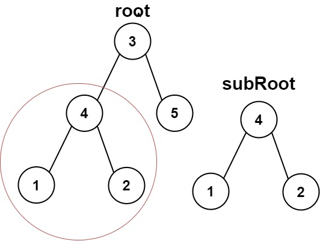

# 🌳 LeetCode 572 — Subtree of Another Tree / 另一棵樹的子樹
🔗 [題目連結](https://leetcode.com/problems/subtree-of-another-tree/)

---

## 📄 題目描述 | Problem Description

### 中文 
給定兩棵二叉樹的根節點 `root` 和 `subRoot`，判斷 `subRoot` 是否為 `root` 的子樹。  
子樹的定義：若從 `root` 的某個節點出發，包括該節點及其所有後代，構成的整棵樹與 `subRoot` 結構與節點值完全相同，即為子樹。

### English  
Given two binary trees `root` and `subRoot`, return `True` if there is a subtree of `root` that is identical in structure and node values to `subRoot`. A subtree is defined as a node in `root` and all of its descendants. The tree `root` could also be considered a subtree of itself.

### Examples
- Examples 1:

    

    - Input: root = [3,4,5,1,2], subRoot = [4,1,2]
    - Output: true

- Examples 2:
    
    

    - Input: root = [3,4,5,1,2,null,null,null,null,0], subRoot = [4,1,2]
    - Output: false

---

## 🧠 解法思路 | Solution Idea

我們把問題拆成兩個部分：

1. **比對兩棵樹是否相同（`isSameTree(p, q)`）**  
   - 若兩個樹都為空 → 相同  
   - 若其中一邊為空或節點值不同 → 不同  
   - 否則，比對左子樹與右子樹是否也一樣  

2. **遍歷 `root` 每個節點，當作潛在子樹起點**  
   - 對 `root` 每個節點呼叫 `isSameTree(node, subRoot)` 看子樹是否匹配  
   - 若匹配 → 回傳 True  
   - 否則繼續向左或向右子樹遞迴查找

整體上，就是「遍歷 + 樹比對」的策略。

---

## 💻 程式碼（Python）

```python
from typing import Optional

# 定義二元樹節點（假設已有這樣的定義）
class TreeNode:
    def __init__(self, val: int = 0,
                 left: Optional['TreeNode'] = None,
                 right: Optional['TreeNode'] = None):
        self.val = val
        self.left = left
        self.right = right

class Solution:
    def isSubtree(self, root: Optional[TreeNode], subRoot: Optional[TreeNode]) -> bool:
        # 如果主樹為空，則無法包含任何非空子樹
        if root is None:
            return False

        # 若從當前節點起的子樹與 subRoot 相同，則成功
        if self.isSameTree(root, subRoot):
            return True

        # 否則嘗試在 root 的左、右子樹繼續尋找
        return (self.isSubtree(root.left, subRoot) or
                self.isSubtree(root.right, subRoot))

    def isSameTree(self, p: Optional[TreeNode], q: Optional[TreeNode]) -> bool:
        # 若兩個節點皆為空 → 相同
        if p is None and q is None:
            return True
        # 若其中一方為空，或節點值不相等 → 不同
        if p is None or q is None or p.val != q.val:
            return False
        # 否則遞迴比對左右子樹
        return (self.isSameTree(p.left, q.left) and
                self.isSameTree(p.right, q.right))
```
| 程式碼區段                                                       | 中文說明                              | English Explanation                                        |
| ----------------------------------------------------------- | --------------------------------- | ---------------------------------------------------------- |
| `if root is None: return False`                             | 若主樹空，則無法有子樹匹配                     | If `root` is empty, it cannot contain `subRoot`            |
| `if self.isSameTree(root, subRoot): return True`            | 若以當前節點為起點與 `subRoot` 一樣，直接回傳 True | If subtree rooted at `root` matches `subRoot`, return True |
| `return ... or ...`                                         | 若當前不匹配，繼續往左右子樹遞迴找                 | Otherwise, search in left or right subtree                 |
| `if p is None and q is None: return True`                   | 當兩樹都為空，視為相同                       | Both nodes are null -> identical                           |
| `if p is None or q is None or p.val != q.val: return False` | 一方為空或值不等 → 不同                     | One null or mismatch → not identical                       |
| `return isSameTree(...) & isSameTree(...)`                  | 左右子樹都必須相同才算整棵樹相同                  | Both left and right subtrees must match                    |

- 當寫：
```python
self.isSameTree(root, subRoot)
```
Python 會做：
```text
p = root
q = subRoot
```
然後進到：
```python
def isSameTree(self, p, q):
```

---

## 🧪 範例設定 | Examples

假設兩棵樹如下：
```makefile
root:
     3
    / \
   4   5
  / \
 1   2

subRoot:
   4
  / \
 1   2
```
- 我們要檢查 subRoot 是否是 root 的子樹。答案應該是 True。

### 步驟 1：呼叫 isSubtree(root, subRoot)，root 的值是 3

- root 不為空

- 呼叫 isSameTree(3, 4) → 值不同 → 回傳 False

- 不成功匹配，再做遞迴：isSubtree(root.left, subRoot) 或 isSubtree(root.right, subRoot)

### 步驟 2：到 root.left 節點，值是 4

- 呼叫 isSubtree(4 subtree, subRoot)

    - root 不為空

    - 呼叫 isSameTree(4, 4) → 值相同，進入下一步比對子樹

        - 比較左子樹：isSameTree(p.left, q.left) → isSameTree(1, 1) → 相同

        - 比較右子樹：isSameTree(p.right, q.right) → isSameTree(2, 2) → 相同

        - 兩邊都相同 → 回傳 True

    - 因為 isSameTree 返回 True，所以 isSubtree 在這一層回傳 True

- 最終結果：isSubtree(root, subRoot) 返回 True

| 呼叫                | root / p 節點 | subRoot / q 節點 | 檢查內容                      | 返回值     |
| ----------------- | ----------- | -------------- | ------------------------- | ------- |
| `isSubtree(3, 4)` | 3           | 4              | `isSameTree(3,4)` → 不同    | False   |
| `isSubtree(4, 4)` | 4           | 4              | `isSameTree(4,4)` → 繼續比左右 | 最終 True |
| 左子樹比較             | 1           | 1              | 相同                        | True    |
| 右子樹比較             | 2           | 2              | 相同                        | True    |


---

## ⏱ 複雜度分析

- 時間複雜度：O(n × m)

    - 根樹 root 有 n 個節點

    - 子樹 subRoot 有 m 個節點

    - 在最壞情況下，對 root 的每個節點都做一次完整的 isSameTree 比對 → n × m

- 空間複雜度：O(h)

    - 遞迴呼叫的最大深度為 root 的高度 h

    - 在最壞情況下，h = n（若樹偏移或像鏈狀）

---

## ✍ 我學到了什麼 / What I Learned

- 將「樹是否為子樹」這種問題拆成：「樹是否相同」＋「遍歷尋找起點」兩部分

- isSameTree 是比較兩棵樹的標準模式，很常在樹題目出現

- 邊界條件（null 處理）非常重要，一但忘了一種情況就容易錯

- 雖然這種寫法看起來簡單，但在有大量重複值或深度大的情況下可能效率不太好

- 若要優化，可考慮 樹序列化 + 字串匹配 或 樹哈希 / 指紋法