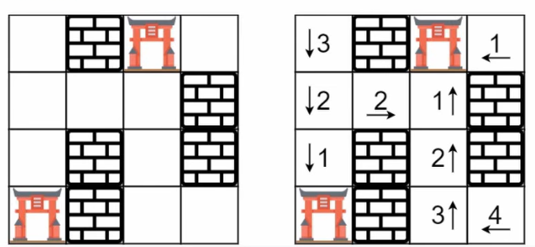

# 📍 LeetCode 286 — Walls and Gates

🔗 https://leetcode.com/problems/walls-and-gates/

## 📄 題目說明 | Problem Description

### 中文

* 給定一個 `m × n` 的房間地圖 `rooms`。

每個位置可能是：

```text
-1  -> Wall（牆壁）
0   -> Gate（門）
INF -> Empty Room（空房間）
```

其中：

```python
INF = 2147483647
```

代表：

```text
目前還不知道距離最近 Gate 多遠
```

你的任務是：

* 把每一個 Empty Room 更新成：

```text
到最近 Gate 的最短距離
```

* 如果某個房間永遠到不了 Gate：

```text
保持 INF
```


### English

* You are given an `m × n` grid called `rooms`.

Each cell can be:

```text
-1 : Wall
0  : Gate
INF: Empty Room
```

* Fill every empty room with the distance to its nearest gate.
* If it is impossible to reach any gate, leave it as `INF`.

### Examples

#### Example 1



Input

```text
[
 [INF,-1, 0,INF],
 [INF,INF,INF,-1],
 [INF,-1,INF,-1],
 [0,-1,INF,INF]
]
```

Output

```text
[
 [3,-1,0,1],
 [2,2,1,-1],
 [1,-1,2,-1],
 [0,-1,3,4]
]
```

---

## 🧠 核心觀念 | Key Insight

* 這題的目標是：

```text
求每個房間
到最近 Gate 的最短距離
```

如果只有一個 Gate：

```text
      G

□ □ □
□ G □
□ □ □
```

我們可以直接：

```text
從 Gate 做 BFS
```

因為：

```text
BFS 第一次到達
就是最短距離
```

但是題目可能有很多 Gate：

例如：

```text
G □ □ □ G
□ □ □ □ □
□ □ □ □ □
```

如果：

```text
每個 Gate 都做一次 BFS
```

那很多房間會被：

```text
重複拜訪很多次
```

效率很差。

因此：

我們把：

```text
所有 Gate
一起放進 Queue
```

例如：

```text
Queue

[(0,2),
 (3,0)]
```

一起開始 BFS。

這就是：

```text
Multi-Source BFS
```

### 為什麼 Multi-Source BFS 可以？

想像：

兩個 Gate 同時開始往外擴散。

```text
第 0 層

      G

G
```

↓

```text
第 1 層

111
1G1
111
```

↓

```text
第 2 層

22222
21112
21G12
21112
22222
```

兩個 Gate 都在：

```text
同時擴散
```

因此：

```text
哪一個 Gate
先到達房間

就代表距離最近
```

完全不用再比較。

### 為什麼 BFS 可以保證最短距離？

因為 BFS 的特性是：

```text
一層一層往外走
```

例如：

```text
Gate

0

第一圈
1

第二圈
2

第三圈
3
```

第一次走到：

```text
某個房間
```

一定就是：

```text
最短距離
```

因此：

```text
不用更新第二次
```

### 為什麼不用 DFS？

假設：

```text
Gate

↓

□□□□□□
```

DFS：

可能一路走到底：

```text
0
1
2
3
4
5
```

之後：

才回來更新旁邊。

結果：

```text
不是最短距離
```

甚至要：

```text
重新更新很多次
```


BFS：

會：

```text
0

↓

1

↓

2

↓

3
```

按照：

```text
距離
```

一層一層擴散。

因此：

```text
第一次到
一定最短
```

### 解題流程

#### Step 1：

掃描整個 Grid。

找到：

```text
所有 Gate
```

全部加入：

```python
queue
```

#### Step 2：

開始 BFS。

每次 Pop：

```python
(r,c)
```

#### Step 3：

往四個方向：

```text
上
下
左
右
```

擴散。

#### Step 4：

如果隔壁是：

```text
INF
```

代表：

```text
第一次拜訪
```

更新：

```python
rooms[nr][nc]
=
rooms[r][c] + 1
```

並加入 Queue。

#### Step 5：

Queue 清空。

所有房間都更新完成。

---

## 💻 Code

```python
class Solution:
    def islandsAndTreasure(self, grid: List[List[int]]) -> None:
        rows, cols = len(grid), len(grid[0])
        visited = set()
        queue = deque()
        def addRoom(r, c):
            if r < 0 or c < 0 or r >= rows or c >= cols or (r, c) in visited or grid[r][c] == -1:
                return
            visited.add((r, c))
            queue.append((r, c))
        for r in range(rows):
            for c in range(cols):
                if grid[r][c] == 0:
                    queue.append((r, c))
                    visited.add((r, c))
        dist = 0
        while queue:
            for i in range(len(queue)):
                r, c = queue.popleft()
                grid[r][c] = dist
                addRoom(r + 1, c)
                addRoom(r - 1, c)
                addRoom(r, c + 1)
                addRoom(r, c - 1)
            dist += 1
```

```python
from collections import deque

class Solution:
    def wallsAndGates(self, rooms):

        if not rooms:
            return

        rows = len(rooms)
        cols = len(rooms[0])

        queue = deque()

        directions = [
            (1,0),
            (-1,0),
            (0,1),
            (0,-1)
        ]

        for r in range(rows):
            for c in range(cols):
                if rooms[r][c] == 0:
                    queue.append((r,c))

        while queue:

            r,c = queue.popleft()

            for dr,dc in directions:

                nr = r + dr
                nc = c + dc

                if (
                    nr < 0
                    or nc < 0
                    or nr >= rows
                    or nc >= cols
                    or rooms[nr][nc] != 2147483647
                ):
                    continue

                rooms[nr][nc] = rooms[r][c] + 1

                queue.append((nr,nc))
```

## 🧾 程式碼逐行解釋 | Line-by-line Explanation

```python
if not rooms:
    return
```

* 如果 Grid 是空的。
* 直接結束。
* 不需要做 BFS。

```python
rows = len(rooms)
cols = len(rooms[0])
```

* 取得 Grid 大小。
* `rows` 代表列數。
* `cols` 代表行數。

```python
queue = deque()
```

* 建立 BFS Queue。
* Queue 裡面放的是：

```text
(r,c)
```

也就是：

```text
目前要擴散的位置
```

```python
directions = [
    (1,0),
    (-1,0),
    (0,1),
    (0,-1)
]
```

* 定義四個方向。
* 分別代表：

```text
下
上
右
左
```

```python
for r in range(rows):
    for c in range(cols):
```

* 掃描整張 Grid。
* 找出：

```text
所有 Gate
```

```python
if rooms[r][c] == 0:
```

* 如果目前位置是 Gate。

```python
queue.append((r,c))
```

* 把 Gate 放進 Queue。
* 注意：

```text
不是只放一個 Gate
```

* 而是：

```text
全部 Gate
一起放
```

這就是：

```text
Multi-Source BFS
```

```python
while queue:
```

* 只要 Queue 裡還有位置，就繼續 BFS。
* Queue 裡的每個位置都代表：

```text
目前已經知道距離 Gate 多遠的位置
```

```python
r,c = queue.popleft()
```

* 從 Queue 最前面取出一個位置。
* BFS 使用 FIFO：

```text
First In, First Out
```

* 這樣才能保證：

```text
距離比較近的位置
會先被處理
```

```python
for dr,dc in directions:
```

* 往四個方向擴散。
* 每次會檢查目前位置的上下左右。

```python
nr = r + dr
nc = c + dc
```

* 計算下一個位置。
* `nr` 是新的 row。
* `nc` 是新的 column。

```python
if (
    nr < 0
    or nc < 0
    or nr >= rows
    or nc >= cols
    or rooms[nr][nc] != 2147483647
):
    continue
```

* 如果下一個位置超出邊界，跳過。
* 如果下一個位置不是 Empty Room，也跳過。

也就是如果它是：

```text
Wall = -1
Gate = 0
已經更新過距離的房間
```

都不能再處理。

```python
rooms[nr][nc] = rooms[r][c] + 1
```

* 更新下一個房間的距離。
* 因為 `(nr,nc)` 是從 `(r,c)` 走一步過來的。
* 所以距離是：

```text
目前距離 + 1
```

```python
queue.append((nr,nc))
```

* 把更新完的房間加入 Queue。
* 讓它之後繼續往外擴散。

---

## 🧪 Example Walkthrough

### Example 1

Input：

```python
INF = 2147483647

rooms = [
 [INF, -1,   0, INF],
 [INF, INF, INF, -1],
 [INF, -1, INF, -1],
 [0,   -1, INF, INF]
]
```

畫成 Grid：

```text
INF  -1   0  INF
INF INF INF -1
INF  -1 INF -1
 0   -1 INF INF
```

### Step 1：找出所有 Gate

* 掃描整個 Grid。
* Gate 是值為 `0` 的位置。

Gate 位置：

```text
(0,2)
(3,0)
```

所以初始 Queue：

```text
queue = [(0,2), (3,0)]
```

這代表：

```text
兩個 Gate 同時開始 BFS
```

### Step 2：處理 Gate (0,2)

目前：

```text
queue = [(0,2), (3,0)]
```

Pop：

```text
(r,c) = (0,2)
```

目前 Grid：

```text
INF  -1   0  INF
INF INF INF -1
INF  -1 INF -1
 0   -1 INF INF
```

從 `(0,2)` 往四個方向走。

### 往下 `(1,2)`

* `rooms[1][2] = INF`
* 可以更新：

```text
rooms[1][2] = rooms[0][2] + 1 = 1
```

Grid 變成：

```text
INF  -1   0  INF
INF INF   1  -1
INF  -1 INF -1
 0   -1 INF INF
```

加入 Queue：

```text
queue = [(3,0), (1,2)]
```

### 往上 `(-1,2)`

* 超出邊界。
* 跳過。

### 往右 `(0,3)`

* `rooms[0][3] = INF`
* 可以更新：

```text
rooms[0][3] = rooms[0][2] + 1 = 1
```

Grid：

```text
INF  -1   0   1
INF INF   1  -1
INF  -1 INF -1
 0   -1 INF INF
```

Queue：

```text
queue = [(3,0), (1,2), (0,3)]
```

### 往左 `(0,1)`

* `rooms[0][1] = -1`
* 是牆壁。
* 跳過。

### Step 3：處理 Gate (3,0)

目前 Queue：

```text
queue = [(3,0), (1,2), (0,3)]
```

Pop：

```text
(r,c) = (3,0)
```

目前 Grid：

```text
INF  -1   0   1
INF INF   1  -1
INF  -1 INF -1
 0   -1 INF INF
```

### 往下 `(4,0)`

* 超出邊界。
* 跳過。

### 往上 `(2,0)`

* `rooms[2][0] = INF`
* 可以更新：

```text
rooms[2][0] = rooms[3][0] + 1 = 1
```

Grid：

```text
INF  -1   0   1
INF INF   1  -1
 1   -1 INF -1
 0   -1 INF INF
```

Queue：

```text
queue = [(1,2), (0,3), (2,0)]
```

### 往右 `(3,1)`

* `rooms[3][1] = -1`
* 是牆壁。
* 跳過。

### 往左 `(3,-1)`

* 超出邊界。
* 跳過。

### Step 4：處理 (1,2)

目前 Queue：

```text
queue = [(1,2), (0,3), (2,0)]
```

Pop：

```text
(r,c) = (1,2)
```

目前距離：

```text
rooms[1][2] = 1
```

目前 Grid：

```text
INF  -1   0   1
INF INF   1  -1
 1   -1 INF -1
 0   -1 INF INF
```

### 往下 `(2,2)`

* `rooms[2][2] = INF`
* 可以更新：

```text
rooms[2][2] = rooms[1][2] + 1 = 2
```

Grid：

```text
INF  -1   0   1
INF INF   1  -1
 1   -1   2  -1
 0   -1 INF INF
```

Queue：

```text
queue = [(0,3), (2,0), (2,2)]
```

### 往上 `(0,2)`

* `rooms[0][2] = 0`
* 是 Gate。
* 跳過。

### 往右 `(1,3)`

* `rooms[1][3] = -1`
* 是牆壁。
* 跳過。

### 往左 `(1,1)`

* `rooms[1][1] = INF`
* 可以更新：

```text
rooms[1][1] = rooms[1][2] + 1 = 2
```

Grid：

```text
INF  -1   0   1
INF   2   1  -1
 1   -1   2  -1
 0   -1 INF INF
```

Queue：

```text
queue = [(0,3), (2,0), (2,2), (1,1)]
```

### Step 5：處理 (0,3)

目前 Queue：

```text
queue = [(0,3), (2,0), (2,2), (1,1)]
```

Pop：

```text
(r,c) = (0,3)
```

目前距離：

```text
rooms[0][3] = 1
```

四個方向：

```text
(1,3) 是牆
(-1,3) 超出邊界
(0,4) 超出邊界
(0,2) 是 Gate
```

沒有新的房間可以更新。

Queue：

```text
queue = [(2,0), (2,2), (1,1)]
```

### Step 6：處理 (2,0)

目前 Queue：

```text
queue = [(2,0), (2,2), (1,1)]
```

Pop：

```text
(r,c) = (2,0)
```

目前距離：

```text
rooms[2][0] = 1
```

### 往上 `(1,0)`

* `rooms[1][0] = INF`
* 可以更新：

```text
rooms[1][0] = rooms[2][0] + 1 = 2
```

Grid：

```text
INF  -1   0   1
 2    2   1  -1
 1   -1   2  -1
 0   -1 INF INF
```

Queue：

```text
queue = [(2,2), (1,1), (1,0)]
```

其他方向：

```text
(3,0) 是 Gate
(2,1) 是牆
(2,-1) 超出邊界
```

### Step 7：處理 (2,2)

目前 Queue：

```text
queue = [(2,2), (1,1), (1,0)]
```

Pop：

```text
(r,c) = (2,2)
```

目前距離：

```text
rooms[2][2] = 2
```

### 往下 `(3,2)`

* `rooms[3][2] = INF`
* 可以更新：

```text
rooms[3][2] = rooms[2][2] + 1 = 3
```

Grid：

```text
INF  -1   0   1
 2    2   1  -1
 1   -1   2  -1
 0   -1   3 INF
```

Queue：

```text
queue = [(1,1), (1,0), (3,2)]
```

其他方向：

```text
(1,2) 已經是 1
(2,3) 是牆
(2,1) 是牆
```

### Step 8：處理 (1,1)

目前 Queue：

```text
queue = [(1,1), (1,0), (3,2)]
```

Pop：

```text
(r,c) = (1,1)
```

目前距離：

```text
rooms[1][1] = 2
```

周圍：

```text
(2,1) 是牆
(0,1) 是牆
(1,2) 已更新
(1,0) 已更新
```

沒有新的房間。

Queue：

```text
queue = [(1,0), (3,2)]
```

### Step 9：處理 (1,0)

目前 Queue：

```text
queue = [(1,0), (3,2)]
```

Pop：

```text
(r,c) = (1,0)
```

目前距離：

```text
rooms[1][0] = 2
```

### 往上 `(0,0)`

* `rooms[0][0] = INF`
* 可以更新：

```text
rooms[0][0] = rooms[1][0] + 1 = 3
```

Grid：

```text
 3   -1   0   1
 2    2   1  -1
 1   -1   2  -1
 0   -1   3 INF
```

Queue：

```text
queue = [(3,2), (0,0)]
```

其他方向：

```text
(2,0) 已更新
(1,1) 已更新
(1,-1) 超出邊界
```

### Step 10：處理 (3,2)

目前 Queue：

```text
queue = [(3,2), (0,0)]
```

Pop：

```text
(r,c) = (3,2)
```

目前距離：

```text
rooms[3][2] = 3
```

### 往右 `(3,3)`

* `rooms[3][3] = INF`
* 可以更新：

```text
rooms[3][3] = rooms[3][2] + 1 = 4
```

Grid：

```text
 3   -1   0   1
 2    2   1  -1
 1   -1   2  -1
 0   -1   3   4
```

Queue：

```text
queue = [(0,0), (3,3)]
```

其他方向：

```text
(2,2) 已更新
(4,2) 超出邊界
(3,1) 是牆
```

### Step 11：處理 (0,0)

目前 Queue：

```text
queue = [(0,0), (3,3)]
```

Pop：

```text
(r,c) = (0,0)
```

目前距離：

```text
rooms[0][0] = 3
```

周圍：

```text
(1,0) 已更新
(-1,0) 超出邊界
(0,1) 是牆
(0,-1) 超出邊界
```

沒有新的房間。

Queue：

```text
queue = [(3,3)]
```

### Step 12：處理 (3,3)

目前 Queue：

```text
queue = [(3,3)]
```

Pop：

```text
(r,c) = (3,3)
```

目前距離：

```text
rooms[3][3] = 4
```

周圍：

```text
(2,3) 是牆
(4,3) 超出邊界
(3,4) 超出邊界
(3,2) 已更新
```

沒有新的房間。

Queue：

```text
queue = []
```

BFS 結束。

### Final Grid

```text
[
 [3,-1,0,1],
 [2,2,1,-1],
 [1,-1,2,-1],
 [0,-1,3,4]
]
```

* 所有能到 Gate 的 Empty Room 都已經被更新成最近距離。
* 牆壁 `-1` 不變。
* Gate `0` 不變。
* 如果有到不了 Gate 的房間，會保持 `INF`。

---

## ⏱ Complexity Analysis

### Time Complexity

* 整張 Grid 有：

```text
rows × cols
```

個格子。

* 每個格子最多只會被加入 Queue 一次。
* 每個格子最多只會被 BFS 處理一次。
* 每次處理格子時，只檢查四個方向。

所以時間複雜度是：

```text
O(rows × cols)
```

### Space Complexity

* Queue 最多可能存放所有房間位置。
* 所以空間複雜度是：

```text
O(rows × cols)
```

---

## 🎯 Interview Takeaways

* 看到題目要找：

```text
每個 Empty Room 到最近 Gate 的距離
```

* 要想到：

```text
Shortest Distance
```

* Grid 上的 shortest distance 通常想到：

```text
BFS
```

* 這題有很多 Gate，所以不是單一起點 BFS。
* 應該使用：

```text
Multi-Source BFS
```

* 也就是：

```text
把所有 Gate 一開始都放進 Queue
```

* BFS 第一次到達某個房間時，就是最近 Gate 的距離。
* 因此不需要重複更新，也不需要比較多個 Gate。

---

## ✍️ 我學到的東西 | What I Learned

* 286 是典型的 Multi-Source BFS 題。
* Gate 是 BFS 起點。
* Empty Room 是可以被更新的地方。
* Wall 不能走。
* 已經更新過距離的房間不能再走。
* BFS 會一層一層擴散，因此第一次到達就是最短距離。
* 不能對每個 Empty Room 去找最近 Gate，會太慢。
* 也不適合從每個 Gate 各自 BFS，會重複拜訪太多格子。
* 最好的做法是：

```text
所有 Gate 同時出發
```

---

## 🆚 BFS vs DFS

### 為什麼用 BFS？

* 因為題目要的是：

```text
最短距離
```

* BFS 的特性是：

```text
一層一層往外走
```

* 所以距離 1 的房間會先被更新。
* 接著才是距離 2。
* 再來才是距離 3。

因此：

```text
第一次到達某個房間
一定是最短距離
```

### 為什麼不用 DFS？

* DFS 會一路走到底。
* 它不保證先走到的路徑是最短的。
* 可能先用一條很長的路更新房間。
* 後面又發現更短路徑，還要重新更新。
* 這會讓邏輯變複雜，也可能造成重複計算。

---

## 🏆 Cheat Sheet

```text
LeetCode 286

Walls and Gates

Grid shortest distance
↓
BFS

Multiple Gates
↓
Multi-Source BFS

Step 1:
Put all gates into queue

Step 2:
BFS from all gates together

Step 3:
Only update INF rooms

Update rule:
rooms[nr][nc] = rooms[r][c] + 1

Why correct?
BFS first visit = shortest distance
```

---

## 🌟 One Sentence Summary

> Start BFS from all gates at the same time. Each time an empty room is reached for the first time, update it with the shortest distance to the nearest gate.

> 從所有 Gate 同時開始 BFS；當 Empty Room 第一次被走到時，就更新成它到最近 Gate 的最短距離。
