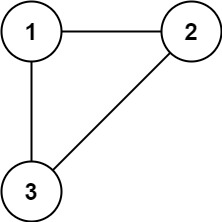
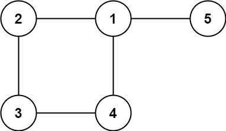

# 📍 LeetCode 684 — Redundant Connection | 多餘的連線

🔗 [題目連結](https://leetcode.com/problems/redundant-connection/)

---

## 📄 題目說明 | Problem Description
### 中文

- 給你一張無向圖 edges，原本是一棵樹（不會有環），但現在多加了一條邊，造成剛好一個環。

- edges[i] = [u, v] 表示 u 和 v 有一條邊。

- 請回傳那條「多餘的邊」：移除它後圖會變回樹。

- 若有多個答案（同一個環可能有多條邊可移除），回傳 在輸入中最後出現 的那條。

### English

- Given an undirected graph that started as a tree and has one extra edge added, return the edge that creates a cycle. If multiple, return the one that appears last in the input.

### Examples
- Example 1:

    

    - Input: edges = [[1,2],[1,3],[2,3]]
    - Output: [2,3]

- Example 2:

    

    - Input: edges = [[1,2],[2,3],[3,4],[1,4],[1,5]]
    - Output: [1,4]
 
---

## 🧠 解題思路 | Solution Idea
- 核心判斷

    - 我們照順序把邊一條條加進去。

    - 加一條邊 [u, v] 前：

        - 如果 u 和 v 已經連通（在同一個集合）

        - 那加上這條邊就會形成環 ✅ 這條邊就是 redundant（多餘邊）

- 為什麼用 Union-Find (DSU)

    - find(x)：找 x 所屬集合的代表（root）

    - union(a, b)：合併兩個集合

    - 如果 find(a) == find(b)：代表 already connected → 這條邊造成 cycle

---

## 💻 程式碼實作 | Code (Python)
```python
from typing import List

class Solution:
    def findRedundantConnection(self, edges: List[List[int]]) -> List[int]:
        n = len(edges)
        parent = [i for i in range(n + 1)]
        rank = [0] * (n + 1)

        def find(x: int) -> int:
            # path compression
            if parent[x] != x:
                parent[x] = find(parent[x])
            return parent[x]

        def union(a: int, b: int) -> bool:
            ra, rb = find(a), find(b)
            if ra == rb:
                return False  # already connected -> cycle if we add this edge

            # union by rank
            if rank[ra] < rank[rb]:
                parent[ra] = rb
            elif rank[ra] > rank[rb]:
                parent[rb] = ra
            else:
                parent[rb] = ra
                rank[ra] += 1
            return True

        for u, v in edges:
            if not union(u, v):
                return [u, v]

```

### DSU 初始化
```python
n = len(edges)
parent = list(range(n + 1))
rank = [0] * (n + 1)
```

- 題目節點編號通常是 1..n（n = 邊數，這題保證節點數也會是 n）

- parent[x] = x：一開始每個點自己是一個集合

- rank：用來做 union by rank（讓樹高度更小）

### find(x)：找 root + 路徑壓縮
```python
if parent[x] != x:
    parent[x] = find(parent[x])
return parent[x]
```

- 如果 x 不是 root（parent[x] != x），就繼續往上找 root

- path compression：把 x 直接連到 root
之後再找會更快

### union(a, b)：合併兩集合 or 偵測成環
```python
ra, rb = find(a), find(b)
if ra == rb:
    return False
```

- ra, rb 是 a、b 的 root

- 如果 root 一樣 → a、b 已經在同一個集合再連一次就會形成環 → 用 False 表示「不能 union」

### union by rank（誰接到誰下面）
```python
if rank[ra] < rank[rb]:
    parent[ra] = rb
elif rank[ra] > rank[rb]:
    parent[rb] = ra
else:
    parent[rb] = ra
    rank[ra] += 1
```

- rank 小的接到 rank 大的下面 → 樹比較矮

- rank 一樣時，隨便接一邊，然後被當 root 的那邊 rank + 1

### 逐邊加入：第一條 union 失敗的邊就是答案
```python
for u, v in edges:
    if not union(u, v):
        return [u, v]
```

- 我們照題目給的順序加邊

- 一旦 union(u, v) 回 False：

    - 代表 u 和 v 早就連通了

    - 這條邊加入必成環 → 就是 redundant edge

- 因為題目要求「若多解回傳最後出現」，而我們是按順序掃，會回到符合條件的那條（這題的標準 DSU 解就是這樣寫）

---

## 🧪 範例流程 | Example Walkthrough
- Example
```text
edges = [[1,2],[1,3],[2,3]]
```

- 初始：

    - parent: 1->1, 2->2, 3->3

- 邊 [1,2]

    - find(1)=1, find(2)=2（不同集合）→ union 成功

- 邊 [1,3]

    - find(1)=1, find(3)=3（不同集合）→ union 成功

- 邊 [2,3]

    - find(2) 會找到 root = 1

    - find(3) 會找到 root = 1

    - root 一樣 → union 回 False ✅ 回傳 [2,3]

---

## ⏱ 複雜度分析 | Complexity Analysis

- 設 n = len(edges)

- 時間複雜度：O(n α(n))（幾乎等於 O(n)）

    - 每條邊做常數次 find/union（含 path compression + rank）

- 空間複雜度：O(n)（parent + rank）

---

## ✍️ 我學到的東西 | What I Learned

- 這題只要抓一句話就能秒殺：

    - ✅ 在無向圖裡，如果一條邊連接的兩點已經連通，那它一定會形成 cycle

- DSU 最常用的判斷就是：

    - if find(u) == find(v): → redundant / cycle edge

---

## 🧠 一句話總結

I add edges one by one using Union-Find; the first edge whose endpoints already share the same root is the redundant connection.