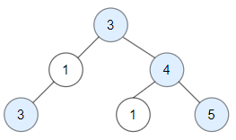

# 📍 LeetCode 1448 — Count Good Nodes in Binary Tree

🔗 https://leetcode.com/problems/count-good-nodes-in-binary-tree/

## 📄 題目說明 | Problem Description

### 中文

* 給定一棵 Binary Tree。
* 如果從 Root 到某個節點的路徑上：

```text
沒有任何節點的值比它大
```

* 則該節點稱為：

```text
Good Node
```

* 回傳 Good Nodes 的數量。

### English

* Given a binary tree root.
* A node X is considered good if no node on the path from the root to X has a value greater than X.
* Return the number of good nodes.

### Examples

#### Example 1

```text
        3
       / \
      1   4
     /   / \
    3   1   5
```

Output:

```text
4
```

Good Nodes:

```text
3
3
4
5
```

#### Example 2



- Input: root = [3,1,4,3,null,1,5]
- Output: 4
- Explanation: Nodes in blue are good.
    - Root Node (3) is always a good node.
    - Node 4 -> (3,4) is the maximum value in the path starting from the root.
    - Node 5 -> (3,4,5) is the maximum value in the path
    - Node 3 -> (3,1,3) is the maximum value in the path.

#### Example 3


- Input: root = [3,3,null,4,2]
- Output: 3
- Explanation: Node 2 -> (3, 3, 2) is not good, because "3" is higher than it.

#### Example 4

- Input: root = [1]
- Output: 1
- Explanation: Root is considered as good.

---

## 🧠 核心觀念 | Key Insight

* 每個節點都需要知道：

```text
從 Root 走到自己
目前最大的值是多少
```

* 例如：

```text
3 → 1 → 3
```

* 目前路徑最大值：

```text
3
```

* 走到最後一個 3 時：

```text
3 >= 3
```

* 因此它是 Good Node。

---

* DFS 時除了傳入：

```python
node
```

* 還需要傳入：

```python
max_so_far
```

代表：

```text
目前路徑上的最大值
```

---

* 判斷條件：

```python
node.val >= max_so_far
```

* 如果成立：

```text
Good Node
```

* 否則：

```text
Not Good Node
```

---

## 💻 Code

```python
class Solution:
    def goodNodes(self, root: TreeNode) -> int:

        def dfs(node, max_so_far):

            if not node:
                return 0

            good = 1 if node.val >= max_so_far else 0

            max_so_far = max(max_so_far, node.val)

            return (
                good
                + dfs(node.left, max_so_far)
                + dfs(node.right, max_so_far)
            )

        return dfs(root, root.val)
```

### 🧾 程式碼逐行解釋 | Line-by-line Explanation

```python
def dfs(node, max_so_far):
```

* 建立 DFS。
* `node` 代表目前節點。
* `max_so_far` 代表：

```text
從 Root 到目前位置
看過的最大值
```

```python
if not node:
    return 0
```

* Base Case。
* 如果目前節點不存在。
* 代表沒有 Good Node。
* 回傳：

```python
0
```

```python
good = 1 if node.val >= max_so_far else 0
```

* 判斷目前節點是不是 Good Node。

如果：

```python
node.val >= max_so_far
```

* 代表：

```text
目前節點沒有被前面的節點蓋過
```

* 因此：

```text
Good Node
```

* 記錄：

```python
good = 1
```

```python
max_so_far = max(max_so_far, node.val)
```

* 更新目前路徑最大值。

例如：

```text
3 → 1 → 5
```

到 5 時：

```python
max(3, 5)
=
5
```

* 接下來所有子樹都要知道：

```text
目前最大值是 5
```

```python
return (
    good
    + dfs(node.left, max_so_far)
    + dfs(node.right, max_so_far)
)
```

* 回傳：

```text
自己是不是 Good Node
+
左子樹 Good Nodes
+
右子樹 Good Nodes
```

```python
return dfs(root, root.val)
```

* 從 Root 開始 DFS。
* Root 一定是 Good Node。
* 因為路徑上只有自己。

所以：

```python
max_so_far = root.val
```

---

## 🧪 Example Walkthrough

### Example 1

```text
        3
       / \
      1   4
     /   / \
    3   1   5
```

### Step 1：Root

```text
node = 3
max_so_far = 3
```

判斷：

```text
3 >= 3
```

✅ Good Node

Count:

```text
1
```

### Step 2：左子樹

```text
node = 1
max_so_far = 3
```

判斷：

```text
1 >= 3
```

❌ Not Good

Count:

```text
0
```

### Step 3：左子樹的左節點

```text
node = 3
max_so_far = 3
```

判斷：

```text
3 >= 3
```

✅ Good Node

Count:

```text
1
```

### Step 4：右子樹

```text
node = 4
max_so_far = 3
```

判斷：

```text
4 >= 3
```

✅ Good Node

更新：

```text
max_so_far = 4
```

Count:

```text
1
```

### Step 5：右子樹左節點

```text
node = 1
max_so_far = 4
```

判斷：

```text
1 >= 4
```

❌ Not Good

Count:

```text
0
```

### Step 6：右子樹右節點

```text
node = 5
max_so_far = 4
```

判斷：

```text
5 >= 4
```

✅ Good Node

Count:

```text
1
```

總數：

```text
1 + 1 + 1 + 1
=
4
```

---

## ⏱ Complexity Analysis

### Time Complexity

* 每個節點只拜訪一次：

```text
O(n)
```

### Space Complexity

* Recursive Stack：

最差：

```text
O(n)
```

* 平衡樹：

```text
O(log n)
```

---

## 🎯 Interview Takeaways

* 看到：

```text
Root 到目前節點的路徑資訊
```

* 通常想到：

```text
DFS + Parameter
```

* 本題要傳的資訊是：

```python
max_so_far
```

* 不需要 Global Variable。
* 不需要 Backtracking。
* 直接把路徑最大值一路往下傳即可。

---

## ✍️ 我學到的東西 | What I Learned

* Good Node 的定義：

```text
node.val >= max_so_far
```

* DFS 不只可以傳：

```python
node
```

* 還可以傳：

```python
max_so_far
```

* 遇到：

```text
Root → Current Node
```

的路徑資訊問題。

通常是：

```text
DFS + 傳參數
```

---

## 🏆 Cheat Sheet

```text
1448

Good Node

node.val >= max_so_far

DFS(node, max_so_far)

更新最大值：

max_so_far =
max(max_so_far, node.val)

答案：

自己
+
左子樹
+
右子樹
```

---

## 🌟 One Sentence Summary

> Use DFS and carry the maximum value seen on the current root-to-node path. A node is good if its value is at least that maximum.

> 使用 DFS 並一路傳遞目前路徑上的最大值，若節點值大於等於該最大值，則為 Good Node。
